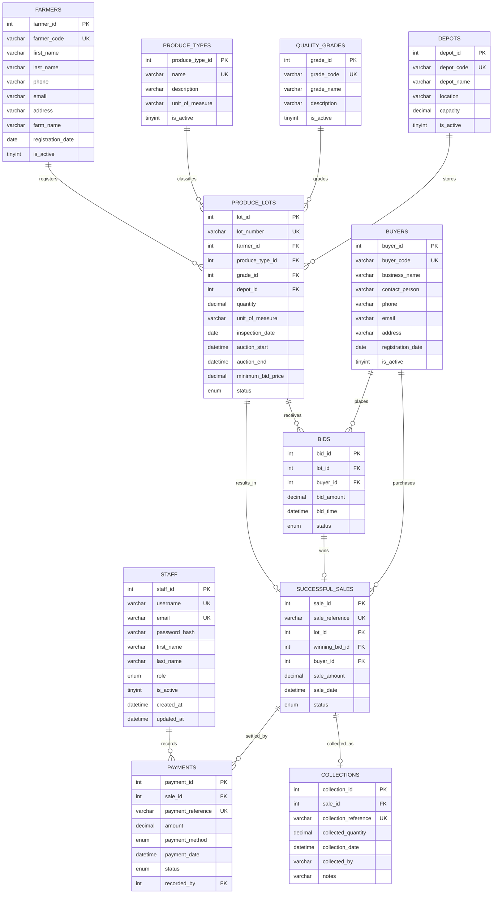

# AgriAuction Entity-Relationship Diagram

This document describes the AgriAuction relational database for **IT212 Database Management Systems**.

The database stores farmers, buyers, produce lots, bids, sales, payments and collections. Business rules such as “a lot can be sold only once” are enforced with keys and constraints, not only with application code.

## 1. Entities

| Entity | Table name | Business meaning |
|---|---|---|
| Staff | `staff` | People who log into the web application |
| Farmer | `farmers` | Registered producers who supply lots |
| Buyer | `buyers` | Registered businesses that bid on lots |
| Produce type | `produce_types` | Commodity catalogue (maize, wheat, and so on) |
| Quality grade | `quality_grades` | Inspection grade (Grade A, B, C) |
| Depot | `depots` | Physical storage and auction location |
| Produce lot | `produce_lots` | One inspected consignment of produce |
| Bid | `bids` | One offer from a buyer on a lot |
| Successful sale | `successful_sales` | The result of a winning bid |
| Payment | `payments` | Money recorded against a sale |
| Collection | `collections` | Buyer collecting purchased produce |

## 2. Attributes, primary keys and unique keys

### Staff

| Attribute | Type | Key | Notes |
|---|---|---|---|
| `staff_id` | INT | **PK** | Surrogate key |
| `username` | VARCHAR(80) | **UNIQUE** | Login name |
| `email` | VARCHAR(120) | **UNIQUE** | Contact email |
| `password_hash` | VARCHAR(255) | | bcrypt hash, never the plain password |
| `first_name`, `last_name` | VARCHAR | | |
| `role` | ENUM | | ADMIN, OPERATOR, AUCTION_CLERK, FINANCE, VIEWER |
| `is_active` | TINYINT(1) | | Inactive staff cannot log in |
| `created_at`, `updated_at` | DATETIME | | Audit timestamps |

### Farmers

| Attribute | Type | Key | Notes |
|---|---|---|---|
| `farmer_id` | INT | **PK** | |
| `farmer_code` | VARCHAR(20) | **UNIQUE** | Human-readable code, for example FRM-0001 |
| `first_name`, `last_name` | VARCHAR | | |
| `phone` | VARCHAR(20) | | |
| `email` | VARCHAR(120) | | Optional |
| `address` | VARCHAR(255) | | |
| `farm_name` | VARCHAR(120) | | |
| `registration_date` | DATE | | |
| `is_active` | TINYINT(1) | | Inactive farmers cannot register new lots |
| `created_at`, `updated_at` | DATETIME | | |

### Buyers

| Attribute | Type | Key | Notes |
|---|---|---|---|
| `buyer_id` | INT | **PK** | |
| `buyer_code` | VARCHAR(20) | **UNIQUE** | For example BUY-0001 |
| `business_name` | VARCHAR(150) | | |
| `contact_person` | VARCHAR(120) | | |
| `phone` | VARCHAR(20) | | |
| `email` | VARCHAR(120) | | Optional |
| `address` | VARCHAR(255) | | |
| `registration_date` | DATE | | |
| `is_active` | TINYINT(1) | | Inactive buyers cannot bid |
| `created_at`, `updated_at` | DATETIME | | |

### Produce types

| Attribute | Type | Key | Notes |
|---|---|---|---|
| `produce_type_id` | INT | **PK** | |
| `name` | VARCHAR(80) | **UNIQUE** | Maize, Soybeans, Wheat, Groundnuts, Sunflower |
| `description` | VARCHAR(255) | | |
| `unit_of_measure` | VARCHAR(20) | | Default unit, for example kg or 50kg bag |
| `is_active` | TINYINT(1) | | |

### Quality grades

| Attribute | Type | Key | Notes |
|---|---|---|---|
| `grade_id` | INT | **PK** | |
| `grade_code` | VARCHAR(20) | **UNIQUE** | For example A, B, C |
| `grade_name` | VARCHAR(80) | | Grade A, Grade B, Grade C |
| `description` | VARCHAR(255) | | |
| `is_active` | TINYINT(1) | | |

### Depots

| Attribute | Type | Key | Notes |
|---|---|---|---|
| `depot_id` | INT | **PK** | |
| `depot_code` | VARCHAR(20) | **UNIQUE** | |
| `depot_name` | VARCHAR(120) | | |
| `location` | VARCHAR(150) | | Zambian location, for example Lusaka |
| `capacity` | DECIMAL(12,3) | | Must be greater than zero |
| `is_active` | TINYINT(1) | | |

### Produce lots

| Attribute | Type | Key | Notes |
|---|---|---|---|
| `lot_id` | INT | **PK** | |
| `lot_number` | VARCHAR(30) | **UNIQUE** | For example LOT-2026-0001 |
| `farmer_id` | INT | **FK** → farmers | Owner of the lot |
| `produce_type_id` | INT | **FK** → produce_types | |
| `grade_id` | INT | **FK** → quality_grades | |
| `depot_id` | INT | **FK** → depots | Storage location |
| `quantity` | DECIMAL(12,3) | | Must be greater than zero |
| `unit_of_measure` | VARCHAR(20) | | Unit recorded at registration |
| `inspection_date` | DATE | | |
| `auction_start`, `auction_end` | DATETIME | | End must be after start |
| `minimum_bid_price` | DECIMAL(12,2) | | Money. Must be greater than zero |
| `status` | ENUM | | REGISTERED, OPEN, CLOSED, SOLD, UNSOLD, COLLECTED |
| `created_at`, `updated_at` | DATETIME | | |

Money uses `DECIMAL(12,2)`, not FLOAT or DOUBLE.

### Bids

| Attribute | Type | Key | Notes |
|---|---|---|---|
| `bid_id` | INT | **PK** | |
| `lot_id` | INT | **FK** → produce_lots | |
| `buyer_id` | INT | **FK** → buyers | |
| `bid_amount` | DECIMAL(12,2) | | Must be greater than zero |
| `bid_time` | DATETIME | | Used as the tie-breaker |
| `status` | ENUM | | VALID, WITHDRAWN, WINNING, REJECTED |
| `created_at` | DATETIME | | |

### Successful sales

| Attribute | Type | Key | Notes |
|---|---|---|---|
| `sale_id` | INT | **PK** | |
| `sale_reference` | VARCHAR(40) | **UNIQUE** | |
| `lot_id` | INT | **FK, UNIQUE** | One sale per lot |
| `winning_bid_id` | INT | **FK, UNIQUE** | One sale per winning bid |
| `buyer_id` | INT | **FK** → buyers | Must match the winning bid’s buyer |
| `sale_amount` | DECIMAL(12,2) | | Copied from the winning bid |
| `sale_date` | DATETIME | | |
| `status` | ENUM | | PAYMENT_PENDING, PARTIALLY_PAID, PAID, COLLECTED, CANCELLED |
| `created_at` | DATETIME | | |

`UNIQUE (lot_id)` is the database’s last line of defence against selling the same lot twice.

### Payments

| Attribute | Type | Key | Notes |
|---|---|---|---|
| `payment_id` | INT | **PK** | |
| `sale_id` | INT | **FK** → successful_sales | |
| `payment_reference` | VARCHAR(40) | **UNIQUE** | |
| `amount` | DECIMAL(12,2) | | Must be greater than zero |
| `payment_method` | ENUM | | BANK_TRANSFER, CASH, MOBILE_MONEY |
| `payment_date` | DATETIME | | |
| `status` | ENUM | | PENDING, VERIFIED, REJECTED |
| `recorded_by` | INT | **FK** → staff | Staff member who captured the payment |
| `created_at` | DATETIME | | |

### Collections

| Attribute | Type | Key | Notes |
|---|---|---|---|
| `collection_id` | INT | **PK** | |
| `sale_id` | INT | **FK, UNIQUE** | One final collection per sale |
| `collection_reference` | VARCHAR(40) | **UNIQUE** | |
| `collected_quantity` | DECIMAL(12,3) | | Must be greater than zero |
| `collection_date` | DATETIME | | |
| `collected_by` | VARCHAR(120) | | Name of the person collecting |
| `notes` | VARCHAR(255) | | Optional |
| `created_at` | DATETIME | | |

## 3. Relationships and cardinalities

| Parent | Child | Cardinality | Meaning |
|---|---|---|---|
| Farmer | Produce lot | **1 : N** | One farmer can register many lots. Each lot belongs to exactly one farmer. |
| Produce type | Produce lot | **1 : N** | One type (for example maize) appears on many lots. |
| Quality grade | Produce lot | **1 : N** | One grade can be used by many lots. |
| Depot | Produce lot | **1 : N** | One depot stores many lots. |
| Produce lot | Bid | **1 : N** | One open lot can receive many bids. |
| Buyer | Bid | **1 : N** | One buyer can place many bids. |
| Produce lot | Successful sale | **1 : 0..1** | A lot is sold at most once. |
| Bid | Successful sale | **1 : 0..1** | At most one bid is the winner of a sale. |
| Buyer | Successful sale | **1 : N** | One buyer can win many sales. |
| Successful sale | Payment | **1 : N** | A sale can be paid in one or more instalments. |
| Staff | Payment | **1 : N** | One staff member can record many payments. |
| Successful sale | Collection | **1 : 0..1** | A sale normally has one final collection. |

Foreign keys use `ON DELETE RESTRICT` and `ON UPDATE RESTRICT`. Historical rows are not hard-deleted. Farmers and buyers are deactivated instead.

## 4. Why these constraints exist

- **Primary keys** uniquely identify every row.
- **Foreign keys** stop a lot from pointing at a farmer, type, grade or depot that does not exist.
- **UNIQUE `lot_id` on `successful_sales`** stops duplicate sales of the same produce.
- **CHECK `quantity > 0` and `minimum_bid_price > 0`** stop invalid lot values.
- **CHECK `auction_end > auction_start`** keeps the auction window valid.
- **DECIMAL** is used for money and quantity so values are exact.

Some rules cannot be fully expressed with keys alone, for example “only an OPEN lot may receive a bid”. Those rules will be enforced later with stored procedures, transactions and application validation.

## 5. Mermaid ERD

This diagram is compatible with GitHub, VS Code Markdown preview and [Mermaid Live Editor](https://mermaid.live).

## 6. How to open this ERD

1. Open `docs/erd.md` in VS Code or Cursor.
2. Use Markdown preview. Mermaid should render the diagram.
3. Or paste the Mermaid block into [https://mermaid.live](https://mermaid.live).
4. In MySQL Workbench you can also reverse-engineer the live schema after `schema.sql` has been loaded: **Database → Reverse Engineer**.
